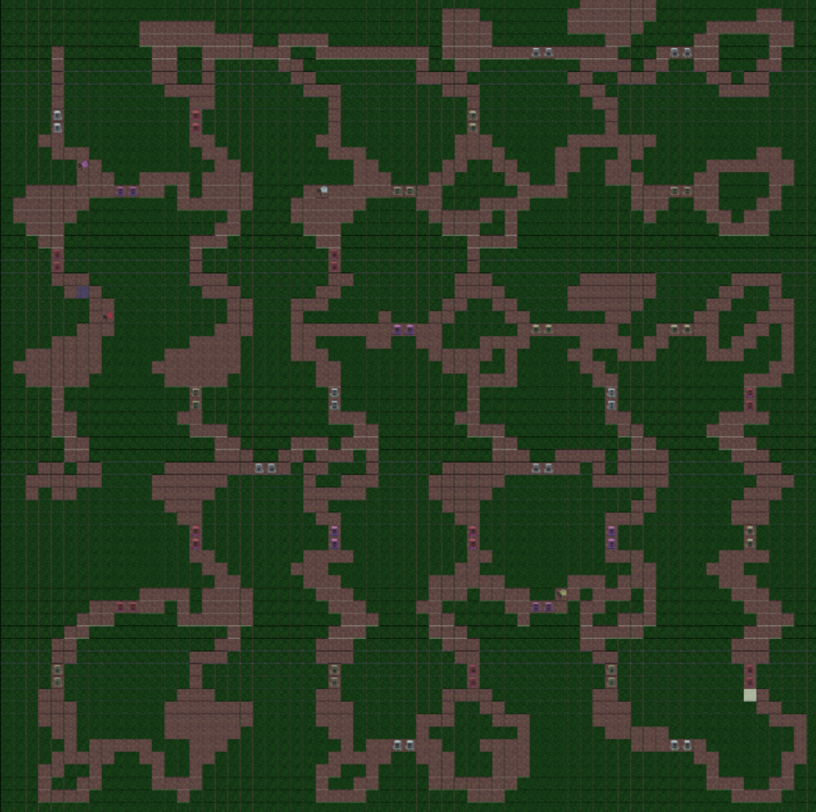
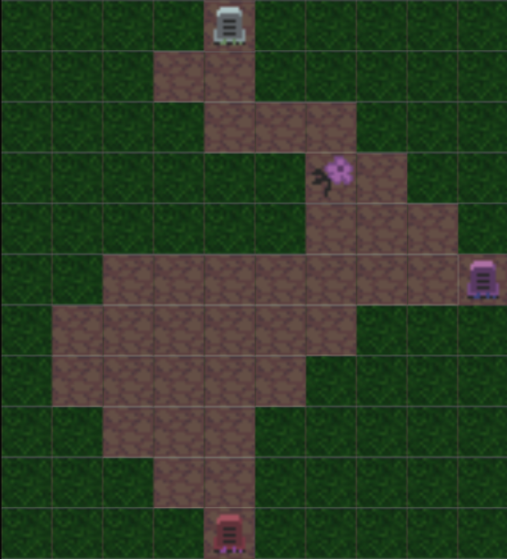

# Final Project!

Example of a full map:

Single room to better see the textures:

#### Introduction
- What motivates your project?

We want to create a dungeon crawler rogue-like game. The basic idea is to have a player start in a procedurally generated dungeon and have the player get to the final room and
proceed to the next level. We want there to be some number of "abilities" that the player can unlock, and some obstacles/puzzles that can't be bypassed except by the use
of these abilities. For the generator, we want to be able to take in a set of inputs (placements of points of interests, obstacle/puzzle elements, start and end positions) which would then be used to generate a solvable dungeon. There may or may not be combat elements based on time contraints, but basic combat elements with enemies/boss seem very possible. This game would be played from a top-down view (like 2.5d) on a grid (although this could probably be changed to free-form/hexagonal/etc with enough persuasion).

#### Goal
- What have you achieved with this project?

We generate a solvable horror level with obstacle and unlockable elements. The obstacles are represented by tombstones, and the unlockable element is the corresponding colored flower. Once you've picked up a flower, you can "unlock" all tombstones of that corresponding color. The level is solvable, meaning that the player is able to get to the final room without encountering a configuration where the player can't get to the end because an ability is locked behind an unbypassable obstacle. Currently our project is not playable, and only generates a map.

To be more technical about how the map is being generated, we !!!!BEN PLEASE ADD STUFF HERE!!!!

This then outputs a text file, where different symbols correspond to different elements. We store this file in an array, and use it as a reference for which tile to draw. All tiles of the same type are drawn using instanced shading.

The interactive demo also supports camera movement. You can zoom in and out of the map by scrolling, and pan around using the right mouse button click and drag.

#### Inspiration/reference:

Our inpiration comes from a couple games, Crypt of the Necrodancer and some of the older 2D Legend of Zelda games as well as other dungeon generators online.

Crypt of the Necrodancer gameplay: https://youtu.be/3dQU5QK_Bh8
We like how in this game the dungeon is generated using a start and end goal, and the entire level is filled with enemies to get past in order to descend the staircase.

Legend of Zelda: Link's Awakening: https://youtu.be/UQlP9sHf5Ho?t=3927
In this snippet, we see how Link equips a feather to jump over a pit to kill enemies and get to the next room, a similar idea to what we want to implement with "abilities" solving "obstacles"

Mario Maker: https://youtu.be/w3FJDipEdtA
The idea of placing down elements on a map would be similar to (but less complex than) how objects are placed to handcraft a Mario Maker level. However we want procedural generation to still take the reins and generate content.

Basic dungeon generator: https://donjon.bin.sh/d20/dungeon/
Just a basic dungeon generator but one that would be similar to how we plan to generate a 2D grid dungeon

#### Specification:

Developer mode to enable placing of elements to be used in the generation of a dungeon level. Be able to define other rules such as walls that the generator must obey.

#### Techniques:

Pathfinding algorithms (DFS,BFS, Uniform Cost Search, etc) https://www.redblobgames.com/pathfinding/a-star/introduction.html

#### Design:

